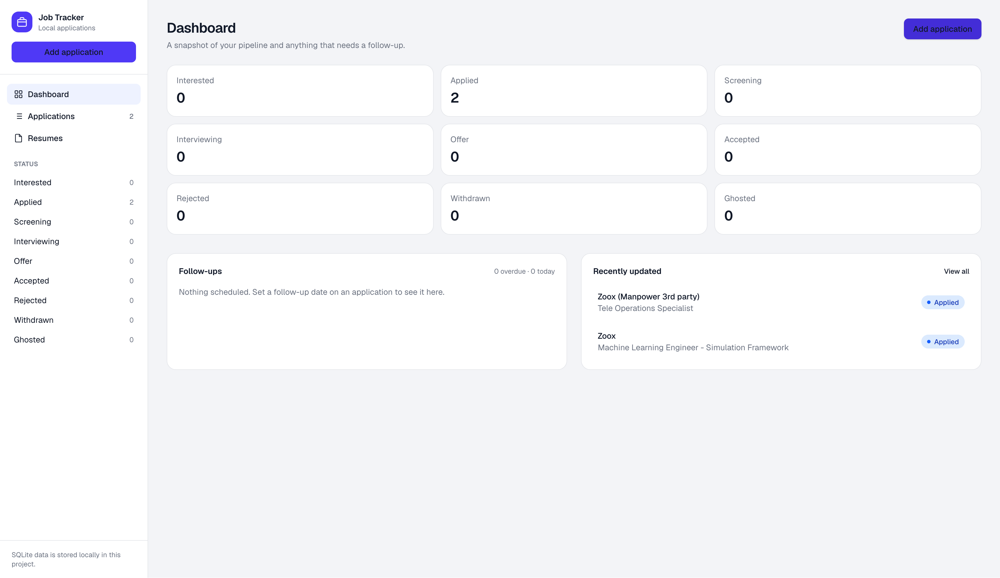
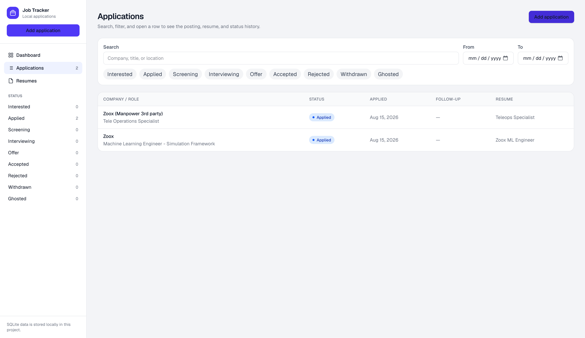
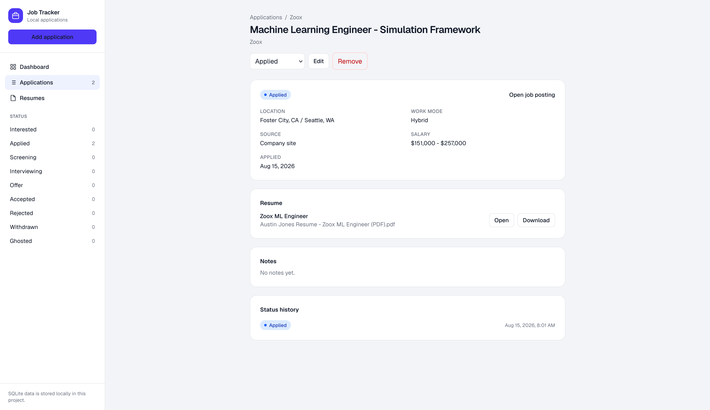

# Job Tracker

A local-first job application tracker. Keep postings, status, and tailored resumes on your machine—no account, no cloud, no spreadsheet.

## Features

- **Applications** — title, company, posting URL, location, work mode, source, salary notes, applied date, follow-up date, and notes
- **Status pipeline** — Interested, Applied, Screening, Interviewing, Offer, Accepted, Rejected, Withdrawn, Ghosted, with an append-only history
- **Resume library** — upload once, reuse across jobs; identical files are stored once (SHA-256)
- **Filters** — search, multi-select status, date range
- **Dashboard** — pipeline counts and follow-ups (overdue, due today, upcoming)
- **Remote access** — optional password gate plus router port-forward or UPnP
- **Local data safety** — SQLite WAL, foreign keys, transactions, startup integrity check, rotating backups
- **Themes** — light, dark, and system, with a mobile-first layout

## Tech stack

| Piece | Choice |
| --- | --- |
| UI | Next.js (App Router), React, TypeScript, Tailwind CSS |
| Database | SQLite via `better-sqlite3` + Drizzle ORM |
| Files | Content-addressed resumes under `data/files/` |

Run it on your laptop and open it in the browser. Nothing is sent to a hosted service.

## Screenshots







## Requirements

- Node.js 18+ (20 or 24 is fine)
- npm

No Docker or separate database. SQLite is a file in the project.

## Usage

```bash
git clone https://github.com/AustinJonesX/job-tracker.git
cd job-tracker
npm install
npm run dev
```

Open [http://localhost:3000](http://localhost:3000). Leave the terminal running. Stop with `Ctrl+C`.

If `better-sqlite3` fails to install on macOS, run `xcode-select --install`, then `npm rebuild better-sqlite3`.

Production-style local run:

```bash
npm run build
npm start
```

### Workflow

1. **Add application** — job title and company are required. Paste the posting link so you can reopen it later.
2. Set **status**. Changing to Applied (or later) fills today’s date if you have not set one.
3. Optionally set a **follow-up**. Overdue items show on the dashboard.
4. Attach a resume (**Upload new** or **Choose existing**).
5. Use search, status pills, and dates on **Applications**. The sidebar jumps to a pre-filtered status.
6. **Resumes** shows which jobs use each file. A resume still attached to an application cannot be deleted.

Removed applications are hidden in the UI (soft delete) and remain in SQLite.

### Remote access

Optional. Lets someone else open the tracker from another network while this computer stays on and the app is running.

1. Open **Remote access**.
2. Add a TCP port-forward on the router for the rule shown (default `WAN 3000 → this computer:3000`), or try UPnP if the router supports it.
3. Set a password and turn sharing on.
4. Send the link and password.

Example: `http://203.0.113.10:3000`. Forward WAN port **80** to drop the port from the URL.

If LAN works but the public IP does not: test from **cellular** (hairpin NAT), confirm the URL port matches the WAN rule, and check you are not on CGNAT (`10.x`, `100.64–100.127`, `172.16–31`, `192.168`). Settings live in `data/share.json` (not committed).

## Data

Everything is under `data/` (gitignored):

| Path | Contents |
| --- | --- |
| `data/job-tracker.db` | Applications, resume metadata, status events |
| `data/files/` | Resume files named by SHA-256 |
| `data/share.json` | Remote-access password and settings |
| `data/backups/` | Startup `VACUUM INTO` snapshots |

Back up by copying `data/` while the app is stopped. Restore by replacing `data/` and starting again.

Writes use WAL, foreign keys, and transactions. On startup the app runs `PRAGMA integrity_check`. If that fails, writes are blocked until you restore from `data/backups/`.

## Layout

```
src/app/(tracker)/   Dashboard, applications, resumes, remote access
src/app/api/         REST: applications, resumes, auth, share, stats
src/components/      Shell, forms, filters, share panel
src/db/              SQLite client, schema, queries
src/lib/             Statuses, dates, share/UPnP helpers
data/                Local database and files (not committed)
```

- [`src/db/schema.ts`](src/db/schema.ts) — tables
- [`src/db/client.ts`](src/db/client.ts) — pragmas, integrity check, backups
- [`src/app/(tracker)/page.tsx`](src/app/(tracker)/page.tsx) — dashboard

## License

MIT. See [LICENSE](LICENSE).
